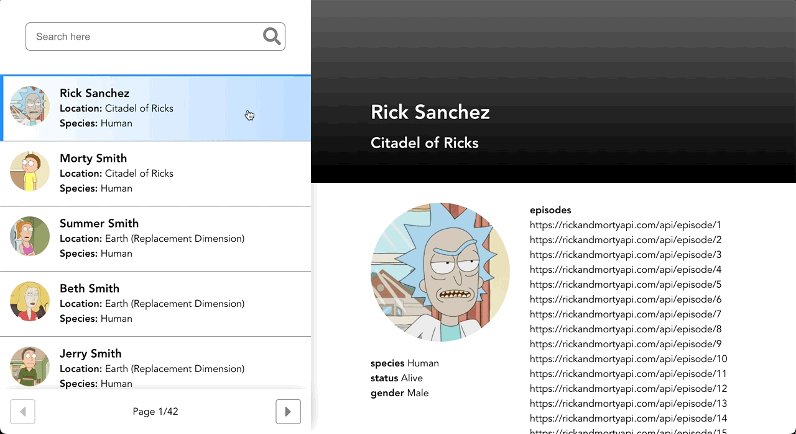

# ilume code challenge

[ilume](https://www.weareilume.com/) is a dog smart tech & food company based in Melbourne/Australia.

I was thinking of working for them, so as part of that I did their code challenge.

Details: Pick 1 library/framework & nothing else; build the below design in 3-5 hours.

(design: locating WIP, basically looks like below)

## 🏁 Features/objectives

1. Build a Rick and Morty character information app to specified design & funtionality
2. Use the [Rick and Morty API](https://rickandmortyapi.com/)
3. Only use 1 library/framework: React
4. Complete it in 3-5 hours

## 🖥️ Tech

1. React `v18.2`
2. Vite `v3`

## 🚀 How to run

1. Fork & clone this repo
2. Have Node `v18` (or newer),
3. Get `yarn` or `npm`
4. in terminal go to DIR &amp; run `yarn` or `npm install`
5. On successful installation, run `yarn dev` or `npm run dev`
6. Finally, open [http://localhost:5173](http://localhost:5173) in your browser to view the app.

## 📝 Notes

Click on the characters to load their details. Search (on input) & pagination should work. Can unselect the character to restore default info view.

I think I did this in 5 hours, at that time I wasn't on the tools as much anymore, mainly training junior front-end devs and reviewing their PRs.
